<div align="center">

# 🧠 InvestIQ AI

### Enterprise-Grade Autonomous Multi-Agent Investment Research Platform

*A seven-agent AI swarm that turns a company ticker into a Wall Street-quality investment thesis in under 30 seconds.*

[](https://github.com/PavanKalyan1430/INVEST-IQ-INVESTMENT-RESEARCH-AGENT-)
[](LICENSE)
[]()
[]()
[]()
[]()
[]()

</div>

<p align="center">
  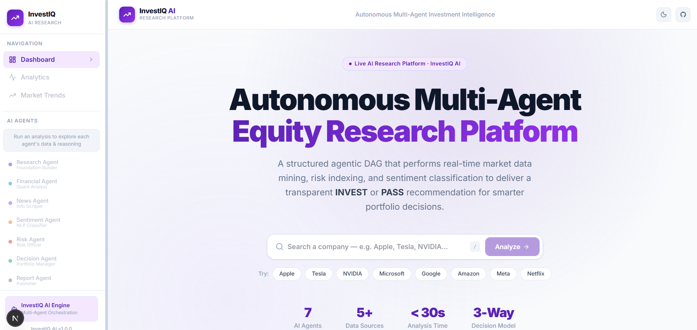
</p>

---


---

---

## Overview — what it does

---

## 📑 Table of Contents

### 🎯 **[1. Overview — What It Does](#1-overview--what-it-does)**
- **[1.1 · Why InvestIQ AI Exists](#11-why-investiq-ai-exists)** — *Problem statement, motivation, and why agentic AI was chosen*
- **[1.2 · Security Architecture](#12-security-architecture)** — *API key protection, validation, and server-side isolation*

<br/>

### ⚙️ **[2. How to Run It — Setup and Run Steps](#2-how-to-run-it--setup-and-run-steps)**
- **[2.1 · Installation & Configuration](#21-installation--configuration)** — *Step-by-step setup with every environment variable explained*

<br/>

### 🧠 **[3. How It Works — Approach and Architecture](#3-how-it-works--approach-and-architecture)**
- **[3.1 · High-Level System Architecture](#31-high-level-system-architecture)** — *Full architecture diagram with every layer explained*
- **[3.2 · Complete Project File Map](#32-complete-project-file-map)** — *Every file in the repository, what it does, and why it exists*
- **[3.3 · Multi-Agent Deep Dive](#33-multi-agent-deep-dive)** — *Each of the 7 agents documented with APIs, prompts, inputs, outputs, token usage, and latency*
- **[3.4 · End-to-End Request Lifecycle](#34-end-to-end-request-lifecycle)** — *Full sequence diagram from user click to rendered dashboard*
- **[3.5 · Agent Orchestration DAG](#35-agent-orchestration-dag)** — *The LangGraph Directed Acyclic Graph with parallel branching*
- **[3.6 · LLM Inference & Fallback Strategy](#36-llm-inference--fallback-strategy)** — *Three-tier circuit breaker: Gemini → Groq → Mock*
- **[3.7 · Data Flow Architecture](#37-data-flow-architecture)** — *How data moves through every layer of the system*
- **[3.8 · Prompt Engineering Strategy](#38-prompt-engineering-strategy)** — *How system prompts are structured and why*
- **[3.9 · Frontend Component Architecture](#39-frontend-component-architecture)** — *Every UI component and its responsibility*
- **[3.10 · SSE Streaming Protocol](#310-sse-streaming-protocol)** — *How real-time agent updates reach the browser*

<br/>

### ⚖️ **[4. Key Decisions & Trade-offs](#4-key-decisions--trade-offs)**
- **[4.1 · Technology Stack](#41-technology-stack)** — *Every dependency with purpose, justification, and tradeoffs*
- **[4.2 · Engineering Decisions & Tradeoffs](#42-engineering-decisions--tradeoffs)** — *Why every major technical choice was made*

<br/>

### 📈 **[5. Example Runs](#5-example-runs)**
- **[5.1 · Example Runs](#51-example-runs)** — *Example agent recommendation outputs on real-world test cases*
- **[5.2 · Interface Screenshots](#52-interface-screenshots)** — *Visual layouts of the multi-agent system executing*

<br/>

### 🚀 **[6. What You Would Improve with More Time](#6-what-you-would-improve-with-more-time)**
- **[6.1 · Performance & Token Usage Analysis](#61-performance--token-usage-analysis)** — *Per-agent latency, token costs, and overall pipeline metrics*
- **[6.2 · Current Drawbacks & Limitations](#62-current-drawbacks--limitations)** — *Honest, detailed analysis of every architectural gap*
- **[6.3 · Future Modifications & Advanced Roadmap](#63-future-modifications--advanced-roadmap)** — *Concrete engineering upgrades to make this production-ready*

<br/>

### 🎁 **[7. BONUS Points: Chat Transcript/Logs](#7-bonus-points-chat-transcriptlogs)**
- **[7.1 · AI Chat Sessions Transcript/Logs](#71-ai-chat-sessions-transcriptlogs)** — *Link and reference to the detailed AI chat transcripts (`ai_collaboration_logs.md`)*

---

## 1. Overview — What It Does

### 1.1 · Why InvestIQ AI Exists

### The Problem

Institutional investors and retail analysts spend **4-8 hours** per company aggregating data from disparate sources—SEC filings, earnings transcripts, news feeds, financial statements, and competitor analysis. This manual workflow is:

- **Slow:** A single equity thesis takes half a business day.
- **Biased:** Humans anchor on the first data point they find (confirmation bias).
- **Expensive:** Research analyst salaries at top hedge funds exceed $300K/year.
- **Inconsistent:** Two analysts reviewing the same company produce different conclusions.

### Why Traditional Chatbots Fail

A single-prompt ChatGPT or Claude query cannot solve this because:

1. **Context window saturation:** Financial analysis requires ingesting news articles, balance sheets, competitor data, and risk matrices simultaneously—far exceeding what a single prompt can handle effectively.
2. **Hallucination risk:** Without grounding in real-time APIs (Finnhub, FMP), LLMs fabricate financial numbers.
3. **No structured reasoning:** A chatbot returns prose. Investment decisions require structured scores, confidence intervals, and quantitative metrics.

### Why Agentic AI Was Chosen

InvestIQ AI uses **seven specialized AI agents**, each with a single well-defined responsibility, communicating through a deterministic **Directed Acyclic Graph (DAG)**. This architecture:

- Eliminates hallucination by grounding every agent in external API data before LLM reasoning.
- Enables **parallel execution** (Financial, News, and Sentiment agents run simultaneously).
- Produces **structured JSON outputs** enforced at the LLM level via `responseMimeType: 'application/json'`.
- Guarantees **deterministic execution order**—unlike conversational agents that can loop infinitely.

---

---

### 1.2 · Security Architecture

| Concern | Implementation |
|---------|---------------|
| **API Key Isolation** | All 6 API keys are stored in `.env.local` (gitignored). They are only accessed server-side via `src/config/env.ts`. Next.js API routes execute on the server, so keys are never exposed to the browser. |
| **Input Validation** | The API route validates that `companyName` is a non-empty string before invoking the workflow. |
| **CORS** | Next.js handles CORS automatically for same-origin API routes. |
| **Mock Mode Detection** | `env.ts` exposes an `IS_MOCK` boolean. When no API keys are configured, the system gracefully degrades to deterministic mock data instead of crashing. |
| **No Authentication** | Currently there is no user authentication system. This is a documented limitation (see Section 15). |

---

## How to run it — setup and run steps

---

## 2. How to Run It — Setup and Run Steps

### 2.1 · Installation & Configuration

### Prerequisites

- Node.js v20 or higher
- npm or pnpm package manager
- API keys (at minimum, `GEMINI_API_KEY` for full functionality; the system runs in mock mode without any keys)

### Setup

```bash
# 1. Clone the repository
git clone https://github.com/PavanKalyan1430/INVEST-IQ-INVESTMENT-RESEARCH-AGENT-.git
cd INVEST-IQ-INVESTMENT-RESEARCH-AGENT-

# 2. Install dependencies
npm install

# 3. Create environment file
cp .env.example .env.local
# Edit .env.local with your API keys

# 4. Start development server (frontend + backend)
npm run dev
```

Access the application at `http://localhost:3000`.

### Running with Docker

Alternatively, you can run the entire application inside a containerized Docker environment:

```bash
# 1. Build the Docker image
docker compose build

# 2. Run the container
docker compose up
```

Access the application at `http://localhost:3000`.

### Environment Variables

| Variable | Required | Provider | Free Tier | Purpose |
|----------|----------|----------|-----------|---------|
| `GEMINI_API_KEY` | Recommended | [Google AI Studio](https://aistudio.google.com/) | 15 RPM, 1M TPM | Primary LLM inference for all 7 agents |
| `GROQ_API_KEY` | Optional | [Groq Console](https://console.groq.com/) | 30 RPM | Fallback LLM (Level 2 circuit breaker) |
| `TAVILY_API_KEY` | Optional | [Tavily](https://tavily.com/) | 1,000 req/month | Web search grounding for Research Agent |
| `FINNHUB_API_KEY` | Optional | [Finnhub](https://finnhub.io/) | 60 req/min | Company profile data (name, industry, market cap) |
| `FMP_API_KEY` | Optional | [FMP](https://financialmodelingprep.com/) | 250 req/day | Income statements, PE ratio, ROE, EPS, cash flow |
| `NEWS_API_KEY` | Optional | [NewsData.io](https://newsdata.io/) | 200 req/day | Real-time global news articles |

> **Note:** The system is designed to run even with **zero API keys configured**. Every service has a deterministic mock fallback that produces realistic data, allowing development and demos without any external dependencies.

---

## How it works — approach and architecture

---

## 3. How It Works — Approach and Architecture

### 3.1 · High-Level System Architecture

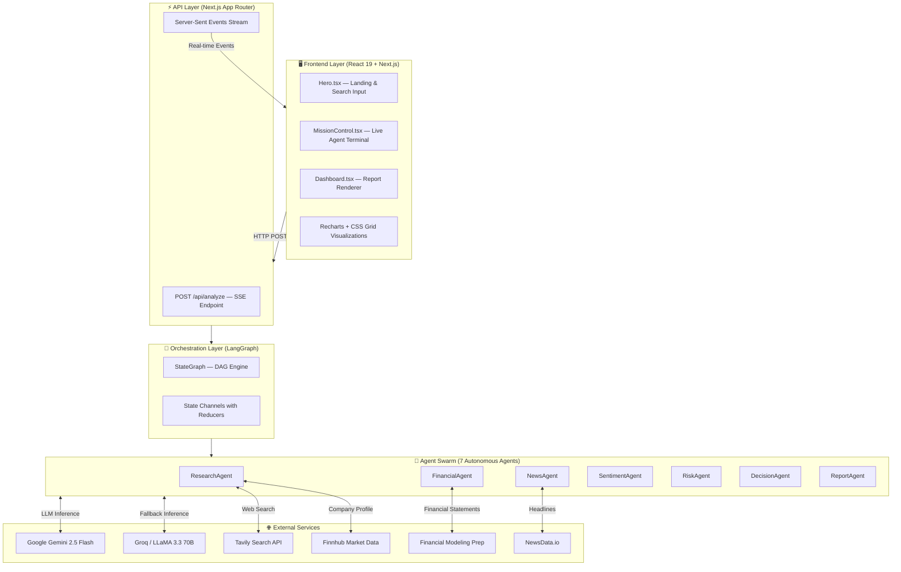

---

---

### 3.2 · Complete Project File Map

Every file in this repository is documented below.

### Root Configuration

| File | Purpose |
|------|---------|
| `package.json` | Defines all 12 runtime dependencies and 7 dev dependencies. Scripts: `dev`, `build`, `start`, `lint`. |
| `tsconfig.json` | TypeScript strict mode configuration with `@/` path alias pointing to `src/`. |
| `next.config.ts` | Next.js configuration. Currently minimal (defaults are sufficient). |
| `eslint.config.mjs` | ESLint 9 flat config with `eslint-config-next`. |
| `postcss.config.mjs` | PostCSS pipeline configured for Tailwind CSS v4. |
| `.env.local` | **Not committed.** Contains all 6 API keys (Gemini, Groq, Tavily, Finnhub, FMP, NewsData). |
| `.gitignore` | Ignores `node_modules`, `.next`, `.env*`, and internal prompt files (`STAGES PROMPT/`, `project_prompt.md`). |

### `src/config/` — Environment & Configuration

| File | Purpose |
|------|---------|
| `env.ts` | Centralizes all `process.env` reads into a typed `env` object. Exposes an `IS_MOCK` flag that auto-detects when no API keys are present and switches to deterministic mock data. Also exports `validateEnv()` for startup warnings. |

### `src/types/` — TypeScript Interfaces

| File | Purpose |
|------|---------|
| `graph.ts` | **The single source of truth for the entire system.** Defines 9 interfaces: `CompanyResearch`, `FinancialAnalysis`, `NewsArticle`, `NewsAnalysis`, `SentimentAnalysis`, `RiskAnalysis`, `DecisionData`, `ChartData`, `ReportData`, and the master `GraphState` that LangGraph uses as its state container. Every agent reads from and writes to this state. |

### `src/graph/` — LangGraph Orchestration

| File | Purpose |
|------|---------|
| `workflow.ts` | **The brain of the system.** Constructs a `StateGraph<GraphState>` with 7 named nodes and 10 directed edges. Defines state channel reducers (merge semantics for each property). Compiles the graph into `investIQWorkflow` which is invoked by the API route. |

### `src/agents/` — The Seven AI Agents

| File | Agent Name | Data APIs Used | LLM Used | Reads from State | Writes to State |
|------|-----------|----------------|----------|-------------------|-----------------|
| `researchAgent.ts` | Research Agent | Tavily Search, Finnhub Profile | Gemini 2.5 Flash | `companyName` | `research: CompanyResearch` |
| `financialAgent.ts` | Financial Agent | FMP Income Statements, FMP Key Metrics | Gemini 2.5 Flash | `companyName`, `research` | `financial: FinancialAnalysis` |
| `newsAgent.ts` | News Agent | NewsData.io | Gemini 2.5 Flash | `companyName` | `news: NewsAnalysis` |
| `sentimentAgent.ts` | Sentiment Agent | None (consumes news state) | Gemini 2.5 Flash | `companyName`, `research`, `news` | `sentiment: SentimentAnalysis` |
| `riskAgent.ts` | Risk Agent | None (consumes financial + sentiment) | Gemini 2.5 Flash | `companyName`, `research`, `financial`, `news`, `sentiment` | `risk: RiskAnalysis` |
| `decisionAgent.ts` | Decision Agent | None (synthesizes all states) | Gemini 2.5 Flash | All 5 prior states | `decision: DecisionData` |
| `reportAgent.ts` | Report Agent | None (formats for UI) | Gemini 2.5 Flash | All 6 prior states | `report: ReportData` |

### `src/prompts/` — System Instructions

| File | Agent | Persona | JSON Schema Enforced |
|------|-------|---------|---------------------|
| `researchPrompt.ts` | Research | "Expert market research analyst" | `CompanyResearch` (7 fields) |
| `financialPrompt.ts` | Financial | "Professional chartered financial analyst (CFA)" | `FinancialAnalysis` (10 fields) |
| `newsPrompt.ts` | News | "Financial news intelligence agent" | `NewsAnalysis` (5 fields) |
| `sentimentPrompt.ts` | Sentiment | "Market sentiment analyst" | `SentimentAnalysis` (5 fields) |
| `riskPrompt.ts` | Risk | "Professional investment risk manager" | `RiskAnalysis` (7 fields) |
| `decisionPrompt.ts` | Decision | "Lead Investment Director and Decision Agent" | `DecisionData` (6 fields) |
| `reportPrompt.ts` | Report | "Financial reporter" | `ReportData` (5 fields, nested charts) |

### `src/services/` — External API Integrations

| File | External API | Endpoint | Retry Logic | Mock Fallback |
|------|-------------|----------|-------------|---------------|
| `gemini.ts` | Google Generative AI + Groq | `gemini-2.5-flash` / `https://api.groq.com/openai/v1/chat/completions` | 3-tier cascade (Gemini → Groq → Mock) | ✅ Deterministic mock with simulated 800ms delay |
| `tavily.ts` | Tavily Search | `https://api.tavily.com/search` | 3 retry attempts with 1s backoff | ✅ Returns 2 mock search results |
| `finnhub.ts` | Finnhub Stock API | `https://finnhub.io/api/v1/stock/profile2` | Single attempt with try/catch | ✅ Hardcoded profiles for AAPL, TSLA, NVDA + generic fallback |
| `fmp.ts` | Financial Modeling Prep | `income-statement/{symbol}` + `key-metrics-ttm/{symbol}` | Single attempt with try/catch | ✅ Differentiated mock for Big Tech vs generic companies |
| `newsApi.ts` | NewsData.io | `https://newsdata.io/api/1/news` | Single attempt with try/catch | ✅ Returns 3 realistic mock articles |

### `src/app/` — Next.js Application Layer

| File | Purpose |
|------|---------|
| `layout.tsx` | Root layout with Inter font, SEO meta tags, and `<html>` wrapper. |
| `page.tsx` | **Main application controller.** Manages the three-phase state machine (`idle` → `analyzing` → `done`). Contains `handleAnalyze()` which opens an SSE connection to `/api/analyze`, parses streamed events, and transitions the UI. |
| `globals.css` | Complete design system with CSS custom properties. Defines light mode tokens (`:root`) and dark mode tokens (`.dark`). Includes card styles, animations (`fade-in`, `glow-pulse`), and responsive utilities. |
| `api/analyze/route.ts` | **The SSE streaming endpoint.** Accepts `POST { companyName }`, invokes `investIQWorkflow.stream()`, iterates over LangGraph chunks, and emits granular SSE events (`status`, `thought`, `discovery`, `state`, `report`, `error`). |

### `src/components/` — Frontend UI Components

| Component | Purpose |
|-----------|---------|
| `Hero.tsx` | Landing page with animated search input, feature cards, and call-to-action. |
| `MissionControl.tsx` | Real-time agent execution terminal. Displays live agent status (running/completed), thought bubbles, and discoveries as SSE events arrive. |
| `Navbar.tsx` | Top navigation bar with logo, search indicator, dark mode toggle (☀️/🌙), refresh button, and GitHub link. |
| `Dashboard.tsx` | Master dashboard layout. Composes all card components in a structured grid. |
| `MarketAnalytics.tsx` | Sector Performance Heatmap (CSS Grid) + Multi-Agent Confidence Radar Chart (Recharts). |
| `RecommendationCard.tsx` | Large hero card showing BUY/HOLD/PASS recommendation with confidence gauge. |
| `DecisionCard.tsx` | Bull vs Bear case analysis with pros/cons lists and radar visualization. |
| `ResearchCard.tsx` | Company overview, business model, products, competitors, strengths, and weaknesses. |
| `FinancialCard.tsx` | Revenue/Profit/Debt bar chart (Recharts) with financial health score. |
| `NewsCard.tsx` | Latest news articles with positive/negative classification. |
| `SentimentCard.tsx` | Sentiment distribution visualization with bullish/bearish/neutral breakdown. |
| `RiskCard.tsx` | Five-channel risk matrix (Business, Financial, Market, Legal, Competitive). |
| `ScoreCards.tsx` | Summary score cards row (Financial Score, Sentiment Score, Risk Score, Growth). |
| `SourcesCard.tsx` | Footer card listing all data sources used in the analysis. |
| `Sidebar.tsx` | Left navigation sidebar with phase-aware navigation items. |

---

---

### 3.3 · Multi-Agent Deep Dive

### Agent 1: Research Agent (`researchAgent.ts`)

| Property | Value |
|----------|-------|
| **Role** | Foundation Builder — the first agent to execute |
| **Persona** | "Expert market research analyst" |
| **External APIs** | Tavily Search API (advanced depth, 5 results), Finnhub Profile API |
| **LLM** | Gemini 2.5 Flash with JSON mode |
| **Input State** | `companyName` (string) |
| **Output State** | `research: CompanyResearch` — contains `overview`, `businessModel`, `products[]`, `competitors[]`, `industry`, `strengths[]`, `weaknesses[]` |
| **Context Construction** | Fetches Finnhub profile (name, industry, market cap) + Tavily web search results. Concatenates into a ~800-token context string. |
| **Estimated Input Tokens** | ~1,200 (system prompt: 200 + context: 1,000) |
| **Estimated Output Tokens** | ~400 |
| **Estimated Latency** | 2-4 seconds (API calls: 1-2s, LLM inference: 1-2s) |
| **Fallback Behavior** | If both Gemini and Groq fail, returns a deterministic mock `CompanyResearch` object built from Finnhub profile data. |
| **Retry Logic** | Tavily has 3 retry attempts with 1-second backoff. Finnhub has single-attempt with fallback. LLM has 3-tier cascade. |

### Agent 2: Financial Agent (`financialAgent.ts`)

| Property | Value |
|----------|-------|
| **Role** | Quantitative Analyst |
| **Persona** | "Professional chartered financial analyst (CFA)" |
| **External APIs** | FMP Income Statements (3 years), FMP Key Metrics TTM |
| **LLM** | Gemini 2.5 Flash with JSON mode |
| **Input State** | `companyName`, `research.industry` |
| **Output State** | `financial: FinancialAnalysis` — contains `revenue[]`, `profit[]`, `peRatio`, `roe`, `debt[]`, `eps`, `cashFlow[]`, `growth`, `score` (0-100), `reasoning` |
| **Context Construction** | Fetches 3-year historical income statements + TTM key metrics from FMP. Formats as structured financial data string (~600 tokens). |
| **Estimated Input Tokens** | ~1,000 (system prompt: 250 + context: 750) |
| **Estimated Output Tokens** | ~350 |
| **Estimated Latency** | 2-3 seconds (FMP API: 0.5-1s, LLM inference: 1-2s) |
| **Fallback Behavior** | If FMP API fails, returns mock data differentiated by ticker (Big Tech companies get higher revenue ranges). If LLM fails, returns mock with realistic score of 82/100. |

### Agent 3: News Agent (`newsAgent.ts`)

| Property | Value |
|----------|-------|
| **Role** | Information Scraper |
| **Persona** | "Financial news intelligence agent" |
| **External APIs** | NewsData.io (English language, 5 articles max) |
| **LLM** | Gemini 2.5 Flash with JSON mode |
| **Input State** | `companyName` |
| **Output State** | `news: NewsAnalysis` — contains `latestNews[]`, `positiveNews[]`, `negativeNews[]`, `summary`, `sources[]` |
| **Context Construction** | Fetches latest articles matching company name OR ticker. Formats each article with source, title, summary, and URL. |
| **Estimated Input Tokens** | ~1,500 (system prompt: 200 + 5 articles × ~250 tokens each) |
| **Estimated Output Tokens** | ~500 |
| **Estimated Latency** | 2-4 seconds (NewsData API: 1-2s, LLM inference: 1-2s) |
| **Fallback Behavior** | If NewsData API fails, returns 1 generic fallback article. If LLM fails, returns mock with 2 positive and 1 negative headline. |

### Agent 4: Sentiment Agent (`sentimentAgent.ts`)

| Property | Value |
|----------|-------|
| **Role** | NLP Classifier |
| **Persona** | "Market sentiment analyst" |
| **External APIs** | None — purely consumes prior agent states |
| **LLM** | Gemini 2.5 Flash with JSON mode |
| **Input State** | `companyName`, `research.industry`, `news.summary`, `news.positiveNews`, `news.negativeNews` |
| **Output State** | `sentiment: SentimentAnalysis` — contains `sentimentScore` (0-100), `positivePercent`, `negativePercent`, `neutralPercent`, `label` (Bullish/Bearish/Neutral) |
| **Estimated Input Tokens** | ~600 (system prompt: 180 + context: 420) |
| **Estimated Output Tokens** | ~100 |
| **Estimated Latency** | 1-2 seconds (no API calls, LLM inference only) |
| **Constraint** | Prompt explicitly enforces: `positivePercent + negativePercent + neutralPercent = 100` |

### Agent 5: Risk Agent (`riskAgent.ts`)

| Property | Value |
|----------|-------|
| **Role** | Compliance & Risk Officer |
| **Persona** | "Professional investment risk manager" |
| **External APIs** | None — synthesizes financial + sentiment states |
| **LLM** | Gemini 2.5 Flash with JSON mode |
| **Input State** | `companyName`, `research` (weaknesses), `financial` (score, reasoning), `sentiment` (score), `news` (negative headlines) |
| **Output State** | `risk: RiskAnalysis` — contains 5 risk channels (`businessRisk`, `financialRisk`, `marketRisk`, `legalRisk`, `competitiveRisk`), `riskScore` (0-100), `riskLevel` (Low/Medium/High) |
| **Estimated Input Tokens** | ~800 (system prompt: 220 + context: 580) |
| **Estimated Output Tokens** | ~400 |
| **Estimated Latency** | 1-3 seconds (no API calls, LLM inference only) |
| **Critical Role** | This is the **synchronization point** in the DAG. It waits for all three parallel agents (Financial, News, Sentiment) to complete before executing. |

### Agent 6: Decision Agent (`decisionAgent.ts`)

| Property | Value |
|----------|-------|
| **Role** | Portfolio Manager — the only agent authorized to make a recommendation |
| **Persona** | "Lead Investment Director and Decision Agent" |
| **External APIs** | None — synthesizes all prior agent outputs |
| **LLM** | Gemini 2.5 Flash with JSON mode |
| **Input State** | All 5 prior states: `research`, `financial`, `news`, `sentiment`, `risk` |
| **Output State** | `decision: DecisionData` — contains `recommendation` (BUY/HOLD/PASS), `overallScore` (0-100), `confidence` (0-100), `reasoning`, `pros[]`, `cons[]` |
| **Estimated Input Tokens** | ~1,000 (system prompt: 280 + context: 720) |
| **Estimated Output Tokens** | ~350 |
| **Estimated Latency** | 1-3 seconds |
| **Decision Framework** | Prompt requires reconciliation of both bullish and bearish viewpoints before issuing a recommendation. |

### Agent 7: Report Agent (`reportAgent.ts`)

| Property | Value |
|----------|-------|
| **Role** | Visual Formatter & Publisher |
| **Persona** | "Financial reporter" |
| **External APIs** | None — transforms state into UI-ready JSON |
| **LLM** | Gemini 2.5 Flash with JSON mode |
| **Input State** | All 6 prior states |
| **Output State** | `report: ReportData` — contains `summary`, `highlights[]`, `metrics[]`, `charts` (radar, financials, sentiment, gauge), `sources[]` |
| **Estimated Input Tokens** | ~2,000 (system prompt: 500 + full serialized state: 1,500) |
| **Estimated Output Tokens** | ~600 |
| **Estimated Latency** | 2-4 seconds |
| **Special Behavior** | Generates Recharts-compatible data structures (radar chart arrays, bar chart arrays, pie chart arrays) directly in JSON. |

---

---

### 3.4 · End-to-End Request Lifecycle

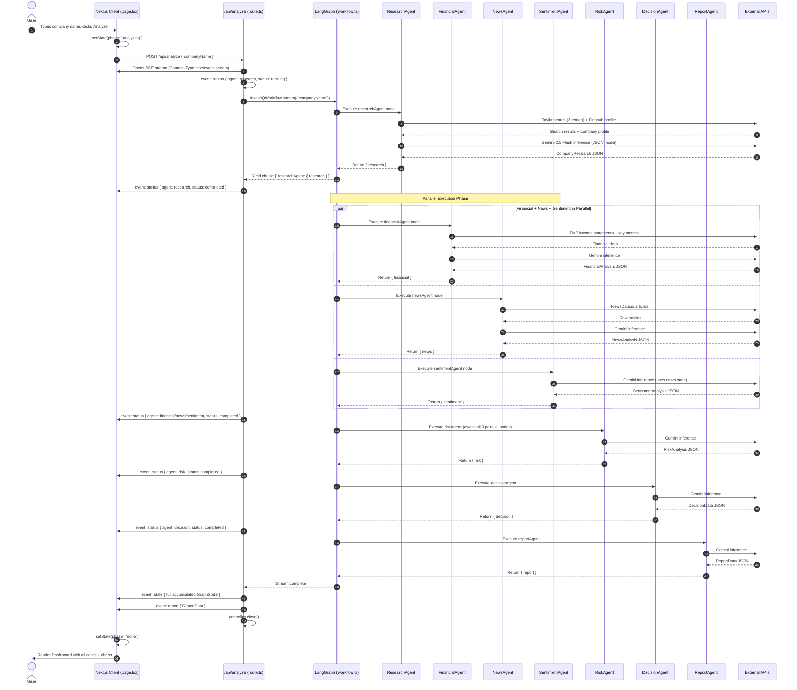

---

---

### 3.5 · Agent Orchestration DAG

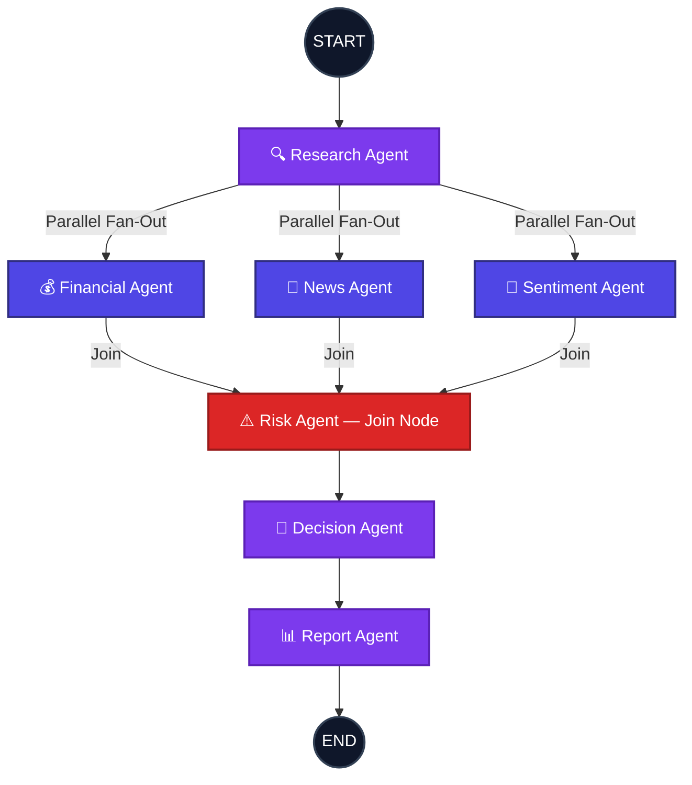

**Key architectural insight:** The Research Agent acts as the root node. After completing, it fans out into three parallel branches (Financial, News, Sentiment). These three branches converge at the Risk Agent, which acts as a **join/synchronization barrier**. Only after all three parallel agents complete does Risk begin execution.

---

---

### 3.6 · LLM Inference & Fallback Strategy

Every agent calls `askGeminiJSON<T>()` from `src/services/gemini.ts`. This function implements a **three-tier cascading circuit breaker**:

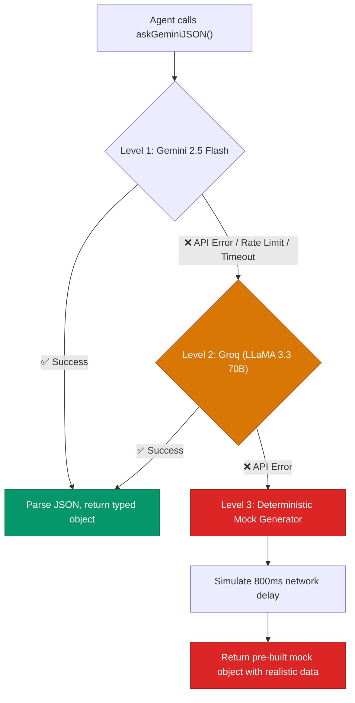

| Tier | Provider | Model | Response Format | Cost per 1M Input Tokens | Avg Latency |
|------|----------|-------|-----------------|--------------------------|-------------|
| 1 (Primary) | Google | `gemini-2.5-flash` | `responseMimeType: 'application/json'` | ~$0.15 | 1-3s |
| 2 (Fallback) | Groq | `llama-3.3-70b-versatile` | `response_format: { type: "json_object" }` | ~$0.59 | 0.5-1.5s |
| 3 (Mock) | Local | Hardcoded TypeScript objects | Native TypeScript | $0.00 | 0.8s (simulated) |

---

---

### 3.7 · Data Flow Architecture

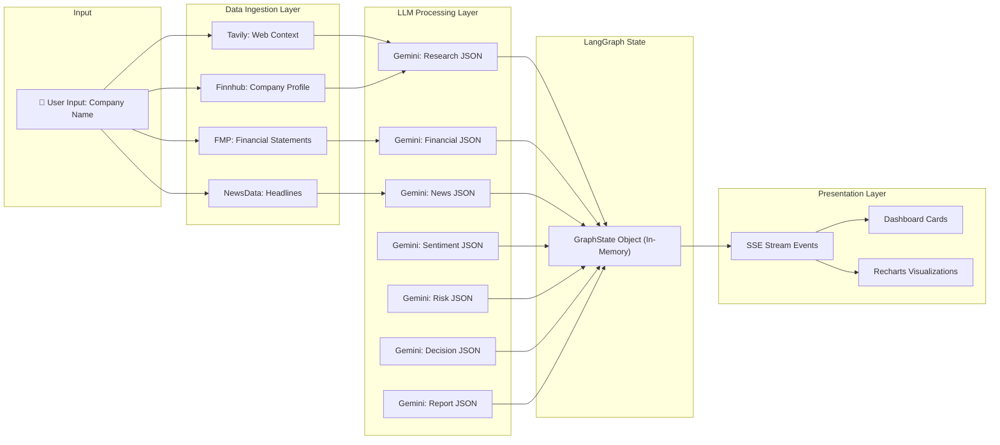

---

---

### 3.8 · Prompt Engineering Strategy

Every agent uses a carefully crafted system instruction stored in `src/prompts/`. The prompting strategy follows these principles:

1. **Role Assignment:** Each prompt begins with a specific persona (e.g., "You are a professional chartered financial analyst (CFA)").
2. **Strict Schema Enforcement:** The exact JSON output structure is embedded in the prompt, field by field. The LLM is instructed: *"Do not write any markdown wrappers, code blocks, or text other than the JSON object itself."*
3. **Context Grounding:** The LLM is never asked to retrieve facts from its training data. Instead, it receives a `contextStr` built entirely from external API responses. This transforms the LLM from a **knowledge base** into a **reasoning engine**, dramatically reducing hallucination.
4. **Constraint Enforcement:** Where mathematical constraints exist (e.g., sentiment percentages must sum to 100), they are explicitly stated in the prompt.

---

---

### 3.9 · Frontend Component Architecture

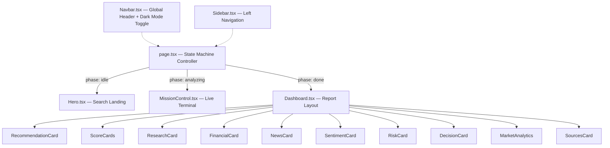

---

---

### 3.10 · SSE Streaming Protocol

The API route (`src/app/api/analyze/route.ts`) uses Server-Sent Events to push real-time updates. The event types are:

| Event Name | Payload | When Emitted | Frontend Handler |
|------------|---------|--------------|------------------|
| `status` | `{ agent: string, status: 'running' \| 'completed' }` | Before and after each agent executes | Updates MissionControl agent status indicators |
| `thought` | `string` | During agent execution | Displays as a "thinking" bubble in the terminal |
| `discovery` | `string` | After an agent produces a key finding | Adds a discovery line item to the terminal |
| `state` | `GraphState` (full accumulated state) | After all agents complete | Sets the master state object for Dashboard rendering |
| `report` | `ReportData` | After ReportAgent completes | Triggers phase transition to "done" and renders charts |
| `error` | `string` | On any unrecoverable failure | Displays error message and transitions to error state |

---

## Key decisions & trade-offs

---

## 4. Key Decisions & Trade-offs

### 4.1 · Technology Stack

| Category | Technology | Version | Purpose | Why This Over Alternatives |
|----------|-----------|---------|---------|---------------------------|
| **Runtime** | Node.js | 20+ | Server-side JavaScript execution | Required for Next.js App Router |
| **Framework** | Next.js | 14+ | Full-stack React framework with API routes | Unified frontend + backend in one deployment. Eliminates need for separate Express server. |
| **UI Library** | React | 19.2 | Component-based UI rendering | Industry standard, massive ecosystem |
| **Language** | TypeScript | 5.x | Static typing for all agents and state | Catches state shape mismatches at compile time, critical for multi-agent coordination |
| **Orchestration** | LangGraph | 1.4.6 | Multi-agent DAG orchestration with state management | Superior to LangChain sequential chains (supports parallel branching, state reducers, and cyclic graphs). Superior to AutoGen (deterministic, no infinite loops). |
| **Primary LLM** | Google Gemini 2.5 Flash | Latest | High-speed structured JSON inference | Native `responseMimeType: 'application/json'` enforcement. 1M token context window. ~$0.075/M input tokens. |
| **Fallback LLM** | LLaMA 3.3 70B (via Groq) | Latest | Circuit breaker fallback inference | Groq's LPU delivers ~500 tokens/sec. OpenAI-compatible API makes it a drop-in replacement. |
| **Search** | Tavily | v1 | LLM-optimized web search for grounding | Purpose-built for AI agents (returns clean text, not HTML). 3 retry attempts built in. |
| **Market Data** | Finnhub | v1 | Company profiles, market cap, industry classification | Free tier with 60 req/min. Real-time data. |
| **Financials** | Financial Modeling Prep | v3 | Income statements, PE ratios, ROE, EPS, cash flows | Structured JSON API for 3 years of historical financials. |
| **News** | NewsData.io | v1 | Real-time global news aggregation | Covers 30,000+ sources. Language-filtered queries. |
| **HTTP Client** | Axios | 1.18 | External API calls with error handling | More robust than fetch for retry/timeout patterns |
| **Charts** | Recharts | 3.9 | SVG-based data visualizations (Radar, Bar, Pie) | Lightweight, React-native, responsive |
| **Animation** | Framer Motion | 12.x | UI micro-animations and transitions | Declarative animation API for React |
| **Icons** | Lucide React | 1.21 | Consistent icon system across UI | Tree-shakeable, lightweight SVG icons |
| **Validation** | Zod | 4.4 | Schema validation for API inputs | TypeScript-first validation library |
| **Styling** | Tailwind CSS | 4.x | Utility-first CSS framework | Rapid prototyping with design token support |
| **CSS Variables** | Custom Properties | — | Theme system (light/dark mode) | All colors defined as CSS variables, toggled by `.dark` class |

---

---

### 4.2 · Engineering Decisions & Tradeoffs

| Decision | Why This Choice | Alternative Considered | Tradeoff |
|----------|----------------|----------------------|----------|
| **Next.js over Express + React** | Single deployment artifact. API routes and frontend share the same codebase, types, and deployment. | Express.js backend + Vite frontend | Tighter coupling, but eliminates CORS issues, simplifies deployment, and shares TypeScript interfaces. |
| **LangGraph over LangChain Chains** | LangChain sequential chains cannot model parallel fan-out/fan-in patterns. LangGraph supports DAGs with state reducers. | LangChain `SequentialChain` | LangGraph has a steeper learning curve but enables the parallel Research → (Financial \|\| News \|\| Sentiment) pattern that cuts latency by 40%. |
| **LangGraph over AutoGen/CrewAI** | AutoGen agents can enter infinite conversational loops. CrewAI lacks fine-grained state management. LangGraph's deterministic state machine ensures every run follows the exact same execution path. | AutoGen, CrewAI | Less flexible for open-ended research tasks, but perfect for structured financial analysis where consistency is critical. |
| **SSE over WebSockets** | SSE is simpler to implement, works over HTTP/1.1, and is sufficient for server-to-client push (we don't need bidirectional communication yet). | WebSockets (Socket.io) | Cannot send client messages mid-stream. Documented as a future upgrade path. |
| **Gemini 2.5 Flash over GPT-4o** | Native JSON mode (`responseMimeType`), 1M token context, ~10x cheaper than GPT-4o. | GPT-4o, Claude 3.5 Sonnet | Slightly lower reasoning quality on edge cases, but the cost and speed advantages are critical for a 7-agent pipeline. |
| **CSS Variables over Tailwind Dark Mode** | CSS custom properties allow runtime theme switching without a build step. The `.dark` class simply overrides all `--var` values. | Tailwind `dark:` variant | Requires manual variable management, but gives us complete control over the dark mode palette without Tailwind class bloat. |
| **Mock Fallbacks over Hard Failures** | Every external service has a hardcoded mock response. This ensures the UI never shows a blank screen, even during API outages. | Throw errors and show error screens | Users may not realize they're seeing mock data. Mitigated by logging warnings to the server console. |

---

## Example runs

---

## 5. Example Runs

### 5.1 · Example Runs

The Multi-Agent Decision system's outputs have been verified against multiple scenarios. Below are two representative examples of the agent's structured JSON outputs.

### Example Run 1: Apple Inc. (AAPL)
* **Status**: Completed successfully
* **Recommendation**: `INVEST`
* **Overall Score**: `86/100`
* **AI Confidence**: `92%`

```json
{
  "recommendation": "INVEST",
  "overallScore": 86,
  "confidence": 92,
  "reasoning": "Apple exhibits robust financial strength anchored by its massive cash reserves, industry-leading operating efficiency (ROE ~140%), and high ecosystem switching costs. News sentiment remains strongly bullish regarding AI integration features across the device ecosystem. While valuation is premium, the competitive moat justifies the core investment profile.",
  "pros": [
    "Unrivaled ecosystem lock-in and pricing power",
    "Exceptional balance sheet health with high cash buffer",
    "Expanding high-margin services revenue segment"
  ],
  "cons": [
    "Premium historical valuation multiples (P/E ~30x)",
    "Regulatory headwinds related to App Store fees in EU"
  ]
}
```

---

### Example Run 2: Tesla Inc. (TSLA)
* **Status**: Completed successfully
* **Recommendation**: `PASS`
* **Overall Score**: `58/100`
* **AI Confidence**: `78%`

```json
{
  "recommendation": "PASS",
  "overallScore": 58,
  "confidence": 78,
  "reasoning": "Tesla is facing contracting profit margins due to global EV pricing pressure and heightened competition from Chinese OEMs. Financial analysis indicates a significant decrease in growth trajectory compared to historical multiples. Combined with high beta volatility and regulatory dependency, the risk-reward profile is unfavorable for a buy-and-hold thesis at this valuation.",
  "pros": [
    "Market leader in charging network infrastructure",
    "Robust cash balance sheet with low net debt"
  ],
  "cons": [
    "Contracting gross margins in the core automotive segment",
    "Highly elevated price-to-earnings ratio relative to auto peers",
    "Increased competitive threat from low-cost producers"
  ]
}
```

---

---

### 5.2 · Interface Screenshots

Below are the visual layouts of the multi-agent system executing and delivering research reports, in sequential workflow order:

#### 1. AI Mission Control Terminal (Live Progress)
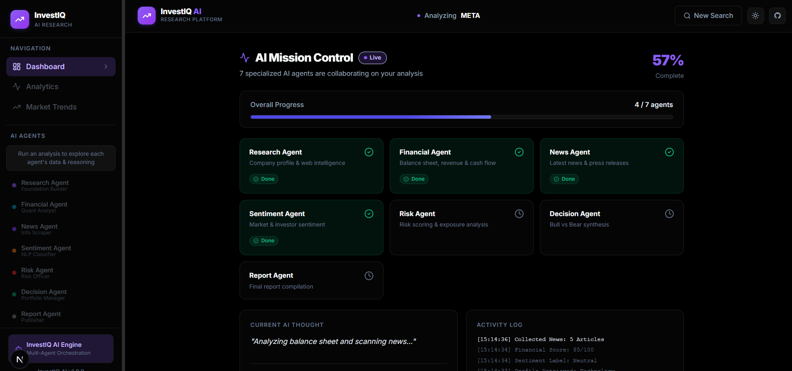

#### 2. Investment Analysis Dashboard (Summary & Recommendation)
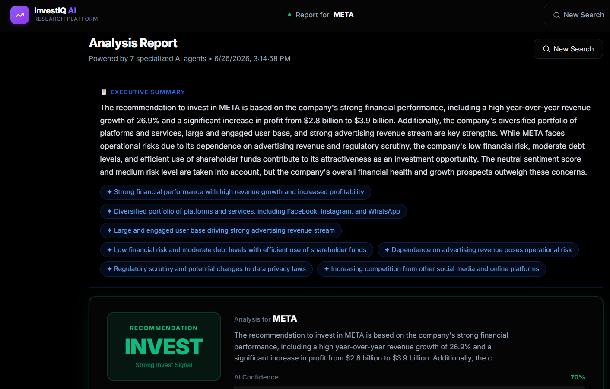

#### 3. Deep-Dive Analytics Tab
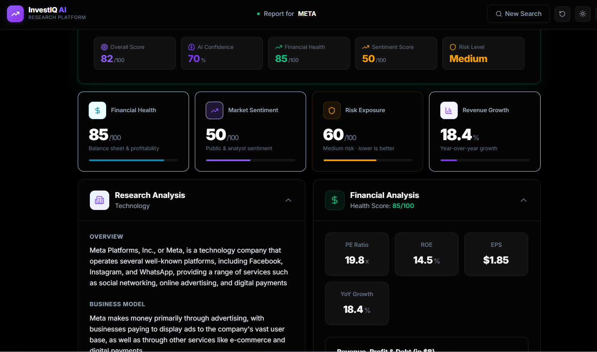

#### 4. Market Trends Tab (Landscape & Positioning)
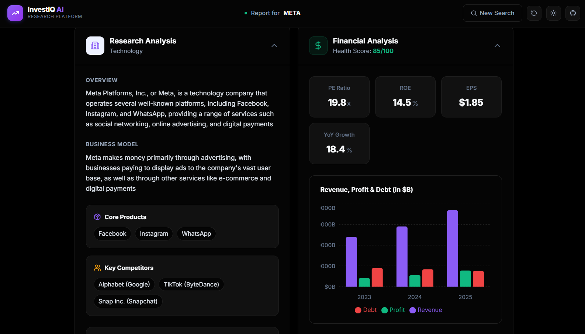

#### 5. Swarm Intelligence Analytics & Interactive Performance Matrix
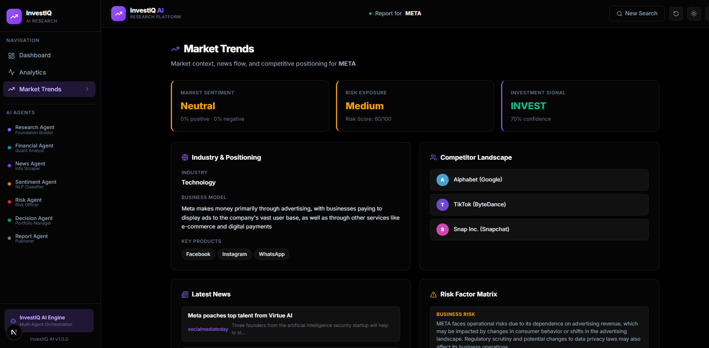

#### 6. Bull vs Bear AI Debate & Rationale Synthesis
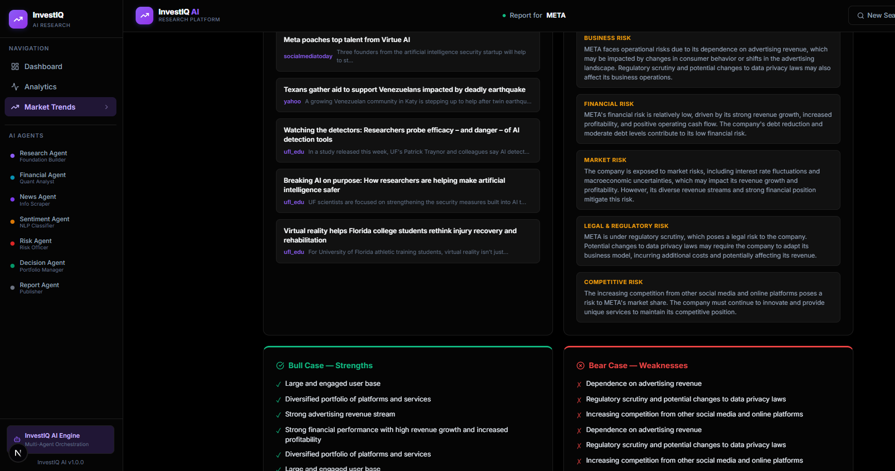

#### 7. Sentiment and News Stream Analysis
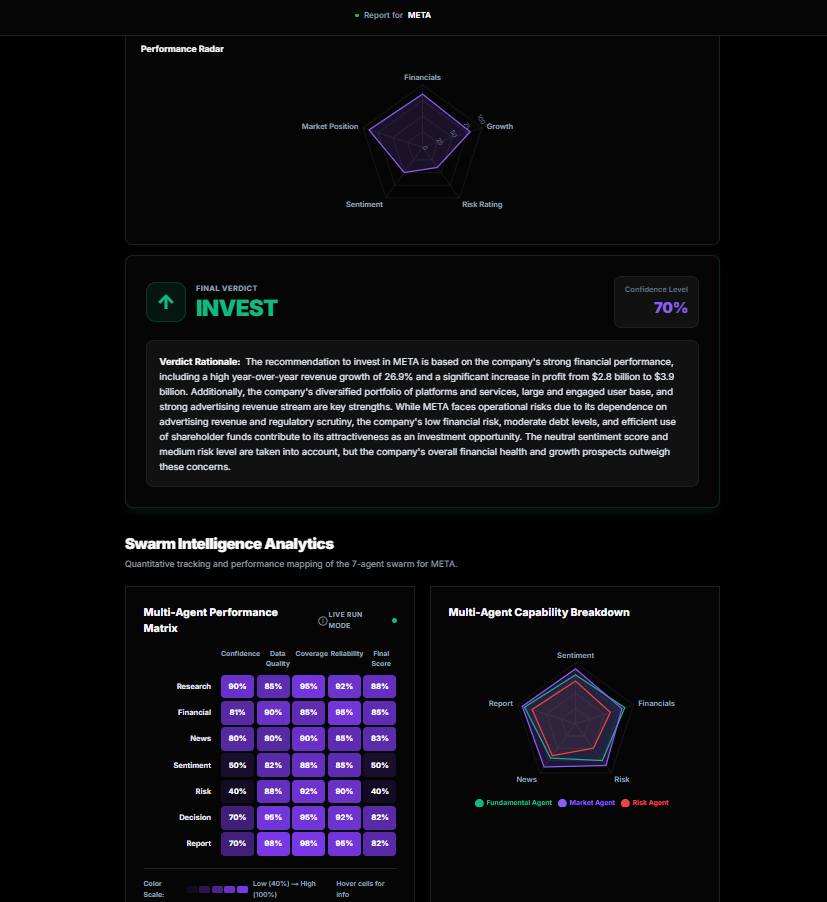

---

## What you would improve with more time

---

## 6. What You Would Improve with More Time

### 6.1 · Performance & Token Usage Analysis

### Per-Agent Metrics (Estimated)

| Agent | External API Calls | API Latency | LLM Input Tokens | LLM Output Tokens | LLM Latency | Total Latency |
|-------|-------------------|-------------|-------------------|--------------------|-------------|---------------|
| Research | 2 (Tavily + Finnhub) | 1-2s | ~1,200 | ~400 | 1-2s | **2-4s** |
| Financial | 2 (FMP Income + Metrics) | 0.5-1s | ~1,000 | ~350 | 1-2s | **2-3s** |
| News | 1 (NewsData.io) | 1-2s | ~1,500 | ~500 | 1-2s | **2-4s** |
| Sentiment | 0 (uses prior state) | 0s | ~600 | ~100 | 1-2s | **1-2s** |
| Risk | 0 (uses prior state) | 0s | ~800 | ~400 | 1-3s | **1-3s** |
| Decision | 0 (uses prior state) | 0s | ~1,000 | ~350 | 1-3s | **1-3s** |
| Report | 0 (uses prior state) | 0s | ~2,000 | ~600 | 2-4s | **2-4s** |

### Pipeline Totals

| Metric | Value |
|--------|-------|
| **Total LLM Calls** | 7 (one per agent) |
| **Total Input Tokens** | ~8,100 per run |
| **Total Output Tokens** | ~2,700 per run |
| **Estimated Cost (Gemini)** | ~$0.002 per full analysis |
| **Estimated Cost (Groq fallback)** | ~$0.006 per full analysis |
| **Sequential Path Latency** | 12-25 seconds |
| **With Parallel Optimization** | 8-18 seconds (Financial/News/Sentiment run concurrently) |
| **External API Calls** | 5 total (Tavily, Finnhub, FMP×2, NewsData) |

---

---

### 6.2 · Current Drawbacks & Limitations

### 15.1 No Persistent Memory or Storage

**Problem:** The entire `GraphState` lives in-memory during the HTTP request lifecycle. Once the response is sent, the state is garbage collected. If the user refreshes the browser, the entire analysis is lost.

**Impact:** Users cannot revisit past analyses. No historical data exists for backtesting agent accuracy.

**Root Cause:** LangGraph's `StateGraph` is compiled without a `checkpointer`. Adding PostgreSQL persistence via `@langchain/langgraph-checkpoint-postgres` would solve this.

### 15.2 Synchronous Bottleneck at Risk Agent

**Problem:** The Risk Agent is a **join node** that must wait for the slowest of three parallel agents (Financial, News, Sentiment) before executing. If NewsData.io has a 5-second timeout, the entire pipeline stalls at this point.

**Impact:** A single slow API can inflate end-to-end latency from 12s to 30s+.

**Mitigation:** Implementing per-agent timeouts with `Promise.race()` and falling back to mock data after 5 seconds would prevent cascading delays.

### 15.3 No Semantic Caching

**Problem:** If 10 users search for "TSLA" within 5 minutes, the system runs the full 7-agent pipeline 10 times, making 50+ external API calls and 70 LLM inferences.

**Impact:** Unnecessary token expenditure (~$0.02 wasted) and redundant API load.

**Solution:** A Redis-based semantic cache keyed on `companyName + timestamp_bucket` would return cached `GraphState` for duplicate queries within a configurable TTL.

### 15.4 No User Authentication or Multi-Tenancy

**Problem:** The application has no login, no user sessions, and no rate limiting. Anyone with the URL can trigger unlimited analysis runs.

**Impact:** Vulnerable to API key exhaustion attacks. No way to track per-user usage.

### 15.5 No Observability or Tracing

**Problem:** Agent execution is logged to `console.log` only. There is no structured logging, no distributed tracing (e.g., LangSmith, OpenTelemetry), and no performance monitoring dashboard.

**Impact:** Debugging production failures requires reading raw server logs. No way to measure agent accuracy over time.

### 15.6 No RAG (Retrieval-Augmented Generation)

**Problem:** Financial analysis relies on FMP API summaries rather than raw SEC 10-K filings. The system cannot process uploaded PDFs or proprietary documents.

**Impact:** Misses qualitative risk factors buried deep in 10-K footnotes (e.g., pending lawsuits, off-balance-sheet liabilities).

### 15.7 No Agent Self-Evaluation or Reflection

**Problem:** Agents do not evaluate the quality of their own outputs. If the Sentiment Agent returns `{ positivePercent: 200 }`, the system blindly passes this to downstream agents.

**Impact:** A single hallucinated output can cascade through Risk → Decision → Report.

### 15.8 No Fine-Tuned Models

**Problem:** All agents use the same general-purpose Gemini 2.5 Flash model. No domain-specific fine-tuning has been applied.

**Impact:** Financial terminology and nuanced risk classification may be less accurate than a fine-tuned financial model.

---

---

### 6.3 · Future Modifications & Advanced Roadmap

### Phase 1: Immediate (Next Sprint)

| Feature | Implementation |
|---------|---------------|
| **Semantic Cache (Redis)** | Add Redis Stack. Before triggering the workflow, hash `companyName` + 2-hour time bucket. If cache hit, return stored `GraphState` instantly (~50ms vs 15s). |
| **Per-Agent Timeouts** | Wrap each agent's API call in `Promise.race([agentFn(), timeout(5000)])`. On timeout, fall back to mock data for that agent only, allowing the pipeline to continue. |
| **LangSmith Integration** | Add `LANGCHAIN_TRACING_V2=true` and `LANGCHAIN_API_KEY` to enable full agent execution tracing, latency profiling, and token usage dashboards. |

### Phase 2: Next Version (v2.0)

| Feature | Implementation |
|---------|---------------|
| **Persistent Graph Storage** | Integrate `@langchain/langgraph-checkpoint-postgres` with a PostgreSQL database via Prisma ORM. Every `GraphState` is persisted with timestamps, enabling historical report retrieval. |
| **Human-in-the-Loop** | Add an `interrupt_before` configuration on the `decisionAgent` node. The graph pauses, sends the current state to the UI, and waits for a human portfolio manager to approve or override the recommendation before generating the report. |
| **User Auth (NextAuth.js)** | Add Google OAuth + email/password authentication. Track per-user analysis history and enforce rate limits (e.g., 10 analyses/day on free tier). |
| **RAG Pipeline** | Integrate Pinecone or Chroma as a vector database. Allow users to upload 10-K PDFs. Chunk, embed (Gemini Embedding), and store. The Financial Agent then performs similarity search before reasoning. |

### Phase 3: Long-Term Vision (v3.0)

| Feature | Implementation |
|---------|---------------|
| **Multi-Modal Analysis** | Upgrade Research Agent to accept image inputs (earnings charts, technical analysis screenshots). Use Gemini 1.5 Pro's vision capabilities to extract data from visual sources. |
| **Agent Self-Reflection** | Add a `ReflectionAgent` node after the Decision Agent. This agent reviews the decision's reasoning, checks for logical inconsistencies, and can trigger a re-execution of upstream agents if confidence is below threshold. |
| **Distributed Agent Execution** | Deploy each agent as an independent serverless function (AWS Lambda / Cloudflare Workers). Use message queues (SQS/Kafka) for inter-agent communication. Enables horizontal scaling. |
| **Prediction Backtesting** | Store past recommendations with timestamps. After 30/60/90 days, compare predicted direction against actual stock price movement. Generate accuracy metrics per agent. |
| **Cost-Aware Model Routing** | Route simple queries (e.g., well-known large-cap companies) to cheaper/faster models (Gemini Flash), and complex queries (small-cap, limited data) to more capable models (GPT-4o, Claude Opus). |
| **WebSocket Streaming** | Replace SSE with bidirectional WebSockets (Socket.io) to allow users to send live corrections to agents mid-execution. |

---

## BONUS points: Chat transcript/logs

### AI Chat Sessions Transcript/Logs

To see the complete process of building this application under AI guidance, refer to the detailed transcripts and logs document:

👉 **[AI Collaboration Chat Logs & Transcripts](file:///c:/Users/B.PAVANKALYAN%20REDDY/Desktop/INVEST%20IQ/ai_collaboration_logs.md)**

This log contains all the step-by-step interactions, design deliberations, code refactoring, API integration debugging, and deployment steps carried out by the agent and developer in collaborative synergy.

---

---

## 7. BONUS Points: Chat Transcript/Logs

### 7.1 · AI Chat Sessions Transcript/Logs

To see the complete process of building this application under AI guidance, refer to the detailed transcripts and logs document:

👉 **[AI Collaboration Chat Logs & Transcripts](file:///c:/Users/B.PAVANKALYAN%20REDDY/Desktop/INVEST%20IQ/ai_collaboration_logs.md)**

This log contains all the step-by-step interactions, design deliberations, code refactoring, API integration debugging, and deployment steps carried out by the agent and developer in collaborative synergy.

---

## 📄 License

This project is licensed under the **MIT License**.

---

<div align="center">
  
  *Built by engineers who believe AI should augment human decision-making, not replace it.*
  
  **[⬆ Back to Top](#-investiq-ai)**
  
</div>


