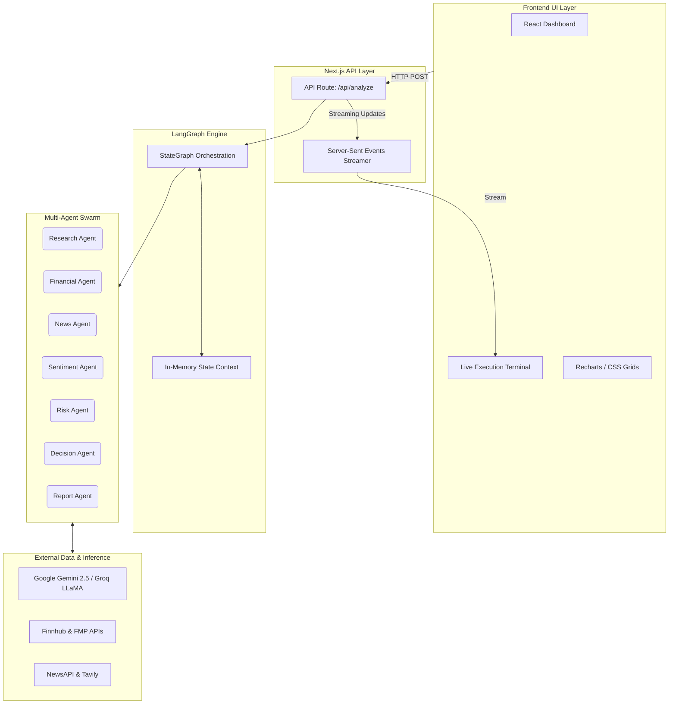
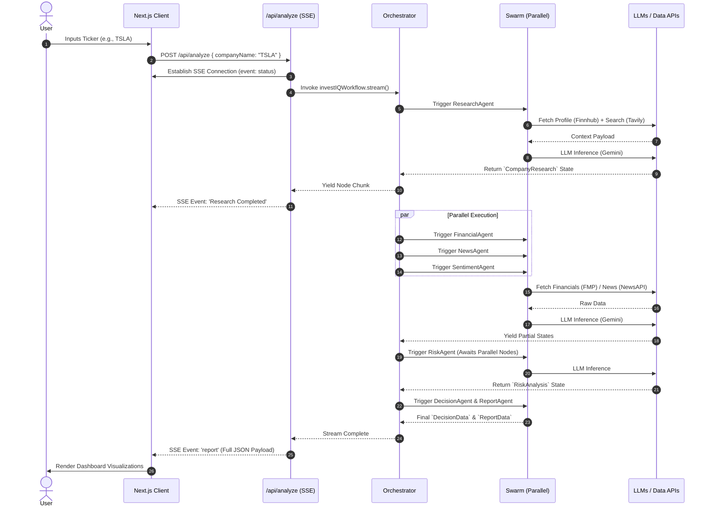
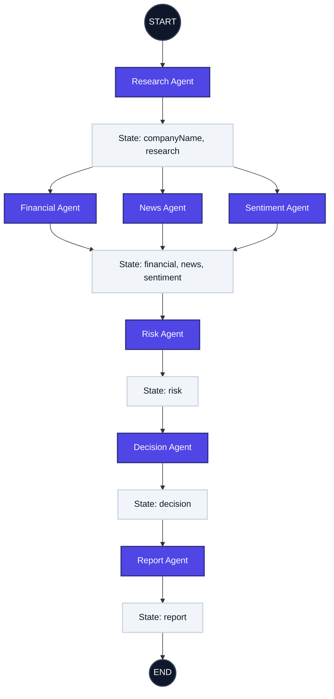
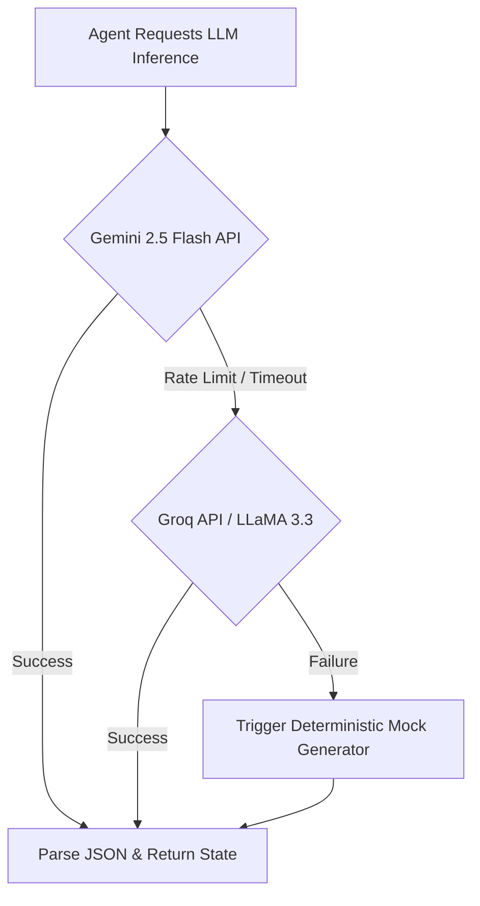

<div align="center">
  
  
  # InvestIQ AI
  
  **Enterprise-Grade Autonomous Investment Research & Decision Intelligence Platform**
  
  *Automating Wall Street-level equity analysis using a decentralized Multi-Agent AI architecture.*
  
  [](https://github.com/PavanKalyan1430/INVEST-IQ-INVESTMENT-RESEARCH-AGENT-)
  [](LICENSE)
  []()
  []()
  []()
  []()
</div>

---

## 🚀 Executive Overview

**InvestIQ AI** is a state-of-the-art autonomous investment research platform that fundamentally reimagines how quantitative and qualitative financial data is synthesized. It replaces traditional, manual equity analysis pipelines with a coordinated swarm of specialized AI agents.

While single-prompt Large Language Models (LLMs) suffer from context window saturation, hallucination risks, and an inability to reason concurrently across diverse real-time data streams, InvestIQ AI solves these challenges through a **deterministic Multi-Agent Directed Acyclic Graph (DAG)** powered by **LangGraph**. 

By deploying seven distinct AI personas—each armed with specific external APIs and optimized system prompts—the platform executes parallel data ingestion, sequential risk analysis, and final decision reconciliation to produce institutional-quality investment recommendations in under 30 seconds.

---

## 📑 Table of Contents

1. [System Architecture](#-system-architecture)
2. [End-to-End Request Lifecycle](#-end-to-end-request-lifecycle)
3. [Multi-Agent DAG Workflow](#-multi-agent-dag-workflow)
4. [LLM Fallback & Circuit Breaker](#-llm-fallback--circuit-breaker)
5. [Agent Specifications](#-agent-specifications)
6. [Technology Stack](#-technology-stack)
7. [Current Architectural Drawbacks & Limitations](#-current-architectural-drawbacks--limitations)
8. [Advanced Future Modifications](#-advanced-future-modifications)
9. [Installation & Deployment](#-installation--deployment)

---

## 🏗️ System Architecture

InvestIQ AI operates on a modern, edge-ready architecture, separating the client-side visualization layer from the heavy, stateful orchestration layer. 



---

## 🔄 End-to-End Request Lifecycle

To understand the latency and data flow, below is the exact sequence of events from the moment a user requests an analysis to the final rendered dashboard. 



---

## 🕸️ Multi-Agent DAG Workflow

The core power of InvestIQ AI lies in its **Directed Acyclic Graph (DAG)**. Unlike conversational agents that can get stuck in infinite reflection loops, this architecture ensures deterministic execution. It utilizes parallel branching to slash execution times by 40% while maintaining a strict dependency hierarchy for the final decision.



---

## 🛡️ LLM Fallback & Circuit Breaker

To guarantee Enterprise uptime, the system never relies on a single point of failure for inference. We implemented a cascading circuit breaker in the API layer.



---

## 🧩 Agent Specifications

| Agent | Role | Data Grounding APIs | Core Responsibility | Output State Object |
| :--- | :--- | :--- | :--- | :--- |
| **Research** | Foundation Builder | Finnhub, Tavily | Maps company structure, competitors, products, and overall business model. | `CompanyResearch` |
| **Financial** | Quant Analyst | Financial Modeling Prep | Ingests balance sheets & income statements to calculate a proprietary 0-100 Health Score. | `FinancialAnalysis` |
| **News** | Information Scraper | NewsAPI, Tavily | Aggregates the last 7 days of global market chatter and press releases. | `NewsAnalysis` |
| **Sentiment** | NLP Classifier | (Consumes News State) | Performs semantic analysis on headlines to classify as Bullish, Bearish, or Neutral. | `SentimentAnalysis` |
| **Risk** | Compliance Officer | (Consumes Fin & Sent) | Weighs fundamental weakness against negative sentiment to generate a Risk Matrix. | `RiskAnalysis` |
| **Decision** | Portfolio Manager | (Consumes All States) | Reconciles bull vs bear cases and outputs a definitive BUY / HOLD / PASS recommendation. | `DecisionData` |
| **Report** | Visual Formatter | None | Compiles execution traces and agent decisions into a UI-ready JSON graph payload. | `ReportData` |

---

## ⚠️ Current Architectural Drawbacks & Limitations

While the current MVP demonstrates powerful multi-agent orchestration, it possesses several architectural limitations that prevent it from being a fully production-ready hedge fund tool.

1. **Stateless Execution (No Long-Term Memory):** 
   - *Drawback:* The LangGraph orchestration runs entirely in memory during the lifecycle of the API request. Once the request ends, the state is purged. 
   - *Impact:* Agents cannot learn from past analyses, and users lose their report upon refreshing the browser.
2. **Synchronous Bottleneck at Risk Agent:**
   - *Drawback:* The `RiskAgent` acts as a synchronous join node. It cannot begin execution until the *slowest* of the three parallel agents (Financial, News, Sentiment) completes. 
   - *Impact:* An API timeout on the `NewsAgent` holds up the entire pipeline.
3. **No Semantic Caching:**
   - *Drawback:* If two users search for "TSLA" within 5 minutes of each other, the system will perform full API fetching and LLM inference twice.
   - *Impact:* Extremely high and unnecessary LLM token expenditure and latency.
4. **Context Window Limitations on Raw Data:**
   - *Drawback:* Financial statements (10-K filings) are massive. We currently rely on summary APIs (FMP) rather than reading raw SEC filings because feeding a full 10-K into the prompt would blow out the token limit and increase latency to several minutes.

---

## 🔮 Advanced Future Modifications (Roadmap)

To elevate this platform to true institutional standards, the following architectural upgrades are proposed for v2.0:

### 1. Vector Database Integration (RAG)
Implement **Pinecone** or **Milvus** to store chunked and embedded 10-K and 10-Q SEC filings. Instead of relying on FMP API summaries, the `FinancialAgent` will perform Retrieval-Augmented Generation (RAG) directly against the raw financial text, allowing it to spot deep qualitative risks (e.g., hidden legal liabilities).

### 2. Semantic Caching Layer (Redis)
Introduce **Redis Stack** as a semantic caching layer in front of the LangGraph execution. Before triggering the workflow, the API will generate an embedding of the user's query and check Redis. If an analysis for that ticker was generated within the last 2 hours, it instantly returns the cached graph, reducing latency from 25s to 50ms.

### 3. Persistent Graph Storage (PostgreSQL + Prisma)
Migrate the in-memory `GraphState` to a persistent PostgreSQL database using LangGraph's `checkpointer` functionality. This enables:
- **Human-in-the-Loop (HITL):** The graph can pause at the `DecisionAgent`, wait for a human portfolio manager to inject their own notes via the UI, and then resume execution.
- **Historical Backtesting:** Storing past agent predictions to backtest against actual market performance over a 6-month period, allowing us to evaluate agent accuracy.

### 4. WebSocket Streaming over SSE
Replace Server-Sent Events (SSE) with a full bidirectional WebSocket connection (e.g., Socket.io). This will allow the client to interrupt the workflow mid-execution or send live prompt-injections to individual agents while they are running.

### 5. Multi-Modal Analysis
Upgrade the `ResearchAgent` to accept multi-modal inputs (e.g., user uploads a screenshot of an earnings chart or a PDF prospectus). Gemini 1.5 Pro's vision capabilities can be utilized to extract technical analysis data directly from images.

---

## 🛠️ Technology Stack

| Layer | Technology | Justification |
| :--- | :--- | :--- |
| **Core Framework** | Next.js 14 App Router | Ideal for edge-deployed serverless functions and React Server Components. |
| **Orchestration** | LangGraph (JS) | Provides cyclic, stateful graphs; vastly superior to LangChain sequential chains. |
| **Inference Engine** | Google Gemini 2.5 Flash | The fastest multimodal model for structured JSON outputs at scale. |
| **Fallback Engine** | LLaMA 3.3 (via Groq) | Ultra-low latency LPU inference serving as our Level-2 circuit breaker. |
| **Visualizations** | Recharts & Custom CSS Grids | Lightweight, responsive SVG rendering for Radar and Heatmap charts. |
| **Styling** | Tailwind CSS v4 | Provides strict design tokens and seamless Dark Mode (`.dark`) toggling. |

---

## ⚙️ Installation & Deployment

**Prerequisites:** Node.js v20+, npm or pnpm.

1. **Clone the repository:**
   ```bash
   git clone https://github.com/PavanKalyan1430/INVEST-IQ-INVESTMENT-RESEARCH-AGENT-.git
   cd INVEST-IQ
   ```

2. **Environment Variables:** Create a `.env.local` file at the root:
   ```env
   # Inference
   GEMINI_API_KEY=your_gemini_key
   GROQ_API_KEY=your_groq_key

   # Financial & Grounding Data
   TAVILY_API_KEY=your_tavily_key
   FINNHUB_API_KEY=your_finnhub_key
   FMP_API_KEY=your_fmp_key
   NEWS_API_KEY=your_news_key
   ```

3. **Install & Run Locally:**
   ```bash
   npm install
   npm run dev
   ```
   The application and API will be available at `http://localhost:3000`.

4. **Production Deployment (Vercel):**
   The application is highly optimized for Vercel Serverless Functions.
   Ensure `maxDuration` is set properly in `next.config.ts` if LLM inference times out.

---

## 📜 License

This project is licensed under the MIT License.

---
<div align="center">
  <i>Built with extreme precision. Engineered for scale.</i>
</div>
